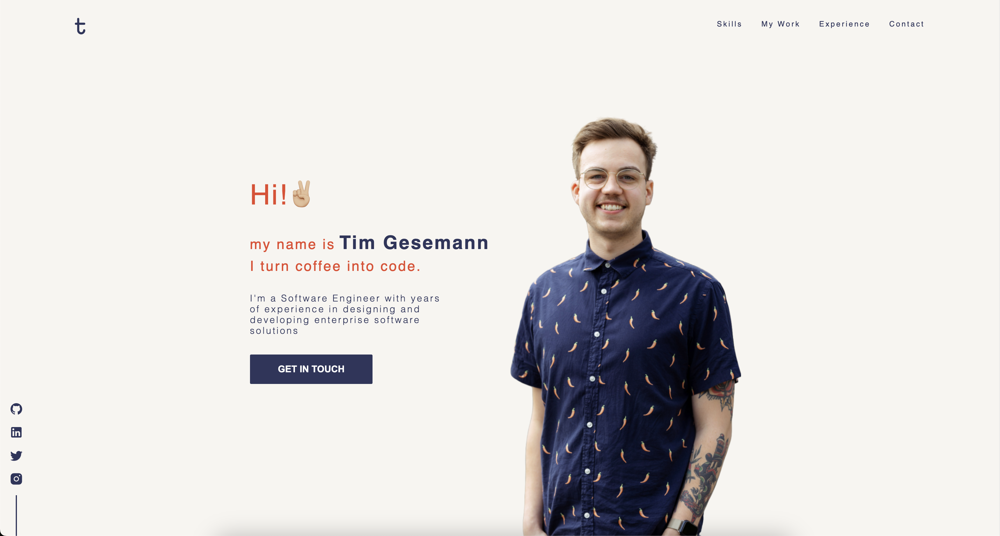

# Hey there 👋🏼

This is the source-code repo of my personal website. If you haven't seen it in action, make sure to check it out at:

  <a href="https://tim-gesemann.dev" style="font-size: 24px;">tim-gesemann.dev</a>

## 🤓 Curious about it?

1. [How was it built?](#how-was-it-built)
   1. [general-tech-stack](#general-tech-stack)
   2. [infrastructure](#infrastructure)
   3. [form-security](#form-security)
   4. [cookies...?](#cookies)
2. [Forking](#forking)
   1. [can i?](#can-i?)
   2. [setup](#setup)
   3. [customization](#customization)
3. [Final words](#final-words)

# 🤔 How was it built?

## general-teck-stack

### FrontEnd

The basis is of course HTML & JS. Based on that I used the following frameworks / libraries

- [SvelteKit](https://kit.svelte.dev/)
- [GSAP](https://gsap.com/)
- [SCSS](https://sass-lang.com/)
- 
