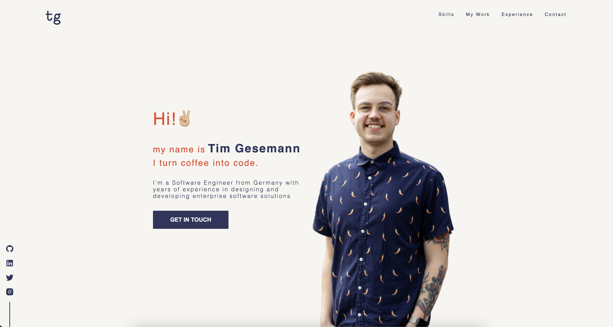

# Hey there 👋🏼

This is the source-code repo of my personal website. If you haven't seen it in action, make sure to check it out at:

<div align="center">
  <a href="https://tim-gesemann.dev" style="font-size: 24px;">tim-gesemann.dev</a>
</div>



## 🤓 Curious about it?

- [🤔 How was it built?](#-how-was-it-built)
  - [general-teck-stack](#general-teck-stack)
    - [FrontEnd](#frontend)
    - [Backend](#backend)
  - [🏗️ Infrastructure](#️-infrastructure)
    - [Disclaimer](#disclaimer)
  - [Form Security](#form-security)
  - [Cookies...](#cookies)
- [🍴 Forking](#-forking)
  - [...can I?](#can-i)
  - [Setup](#setup)
    - [dev](#dev)
    - [build](#build)
- [Final Words](#final-words)

# 🤔 How was it built?

## general-teck-stack

### FrontEnd

The <strong>design</strong> was done using [Figma](https://www.figma.com/).
The basis of the implementation is of course HTML & JS. Based on that I used the following frameworks / libraries

- [SvelteKit](https://kit.svelte.dev/)
- [GSAP](https://gsap.com/)
- [SCSS](https://sass-lang.com/)
- [SvelteEmail](https://github.com/carstenlebek/svelte-email)
- [GoogleAnalytics](https://analytics.google.com)
- [Google reCaptchaV3](https://developers.google.com/recaptcha/docs/v3)
- [Superform Client Side](https://superforms.rocks/)

### Backend

In the and the backend is just some serverless js function in a node runtime. Running in either AWS, Azure or GoogleCloud orchestrated by [Vercel](https://vercel.com/). This is what i used to build it:

- [SvelteKit](https://kit.svelte.dev/)
- [Zod](https://zod.dev/)
- [SendGrid](https://app.sendgrid.com/)
- [Superform Server Side](https://superforms.rocks/)

In addition to that i also used ESLint, StyleLint, Prettier, several VS-Code Plugins for formatting and best practices.

## 🏗️ Infrastructure

### Disclaimer

I'm only controlling the `google-domains` & `github` frames in this diagram. Beyond that I'm using `vercel's sveltekit integration`. What you see in the figure is only what <strong>I THINK</strong>, vercel is doing behind the scenes.


## Form Security

To avoid big bills from spam attacks i decided to "secure" the contact form with a captcha, to prevent bots from doing requests. I'm using googles [reCaptcha v3](https://developers.google.com/recaptcha/docs/v3), as it seems quite reliable and works passively without the need of the user to pass a puzzle or something.

## Cookies...

The downside of reCaptcha (and also google analytics) is that a `privacy policy`,`cookie policy` and `cookie-banner` become mandatory when using them. And because i don't wanna get sued i did exactly that. I did it on my own, but there are probably plenty of libraries out there which will do the job

# 🍴 Forking

## ...can I?

Sure! Go for it! I'd appreciate if you somehow mention that you got inspired by this project, tho.
A cup of coffee would also help me to create more projects like this.

<a href="https://www.buymeacoffee.com/timges" target="_blank"></a>

## Setup

### dev

pretty straight forward tbh. Just clone the repo, run

```sh
npm i
```

start the dev server via

```sh
npm run dev
```

and thats it. There's more scripts for linting and stuff. Just check out the [package.json](package.json)

### build

you can build the app by running

```sh
npm run build
```

output can be found in `.svelte-kit > output`. Make sure to install the correct [svelte-kit adapter](https://kit.svelte.dev/docs/adapters) to match your needs. I used the `auto` one as vercel handles the build process anyways. Feel free to [check them out](https://vercel.com/home) (not sponsored btw, just satisfied lol)!

# Final Words

This is currently the first version of this site, so you may find a few bugs or code-smells here and there. If you find anything, or have some advice for improvement feel free to drop a message :)

...and yeah. I know that tests are missing 😵‍💫
